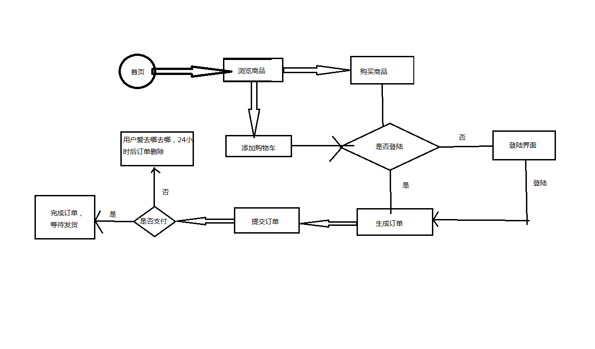

# 项目说明书 #
## Vivo商城系统 ##

>文件状态： 
- [x] 草稿
- [ ] 正式发布
- [ ] 正在修改

> * 文件标识：	PHP25期, 三人行
> * 当前版本：	V1.0
> * 队   伍：	陈泽涛、李汶潇、韦顺隆
> * 完成日期：	2017-4-21

小组说明书
组长：陈泽涛
组员：韦顺隆、李汶潇、陈泽涛

项目名称：vivo
项目分工：
李汶潇：个人中心，，后台登入登出，用户管理，权限管理

韦顺隆：首页、导航栏、搜索栏、商品列表、商品详情、商品管理，首页管理

陈泽涛：登陆注册订单页、购物车、生成订单、订单管理、友情链接管理、

#一、项目的描述、目标

	描述: vivo官网。
	目标: 更快，更美，更完善。

#二、系统功能结构

	前台: +首页+导航栏、+搜索栏、+商品列表、+商品详情、、、#个人中心、登陆注册。评论管理

	后台: #登陆退出、#用户管理、#权限管理、+商品管理+首页管理、
#三、系统流程图

;

#四、具体的业务描述：

	首页：为静态页面，可以在后台修改首页数据。
	商品列表: 分页, 按类搜索, 按价格排序
	商品详情: 用户下拉到参数后才请求数据库拿数据(AJAX)
	登陆注册: 
		1、前台用js正则判断输入数据是否符合标准，不标准则提示.
		2、可以使用第三方登陆(邮箱、手机);
		3、登陆失败1次之后需要验证码。出错6次则冻结账号30分钟。
	购物车: 不需要登陆可以加入商品。 保存期限为7天。
	订单页: 使用事务处理。 不支付则保留订单24小时。过期删除。
	用户管理: 增删改查
	权限管理: 增删改查
	商品管理: 增删改查
	首页管理: 页面静态化
			

#五、系统运行环境
	

	系统环境：
		  运行的系统：linux  window
		  php版本	5.6
          mysql版本	5.5
		  Apache/2.4.7 (Unix)
	
